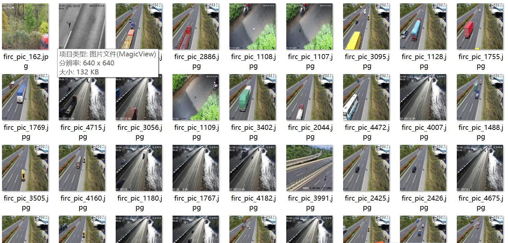
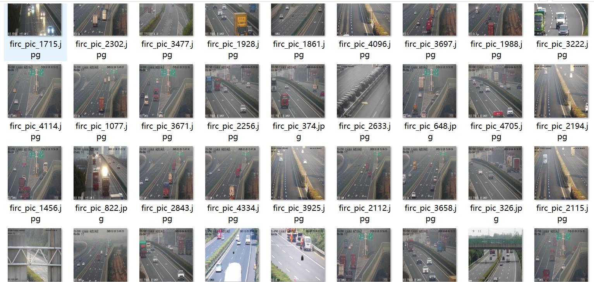
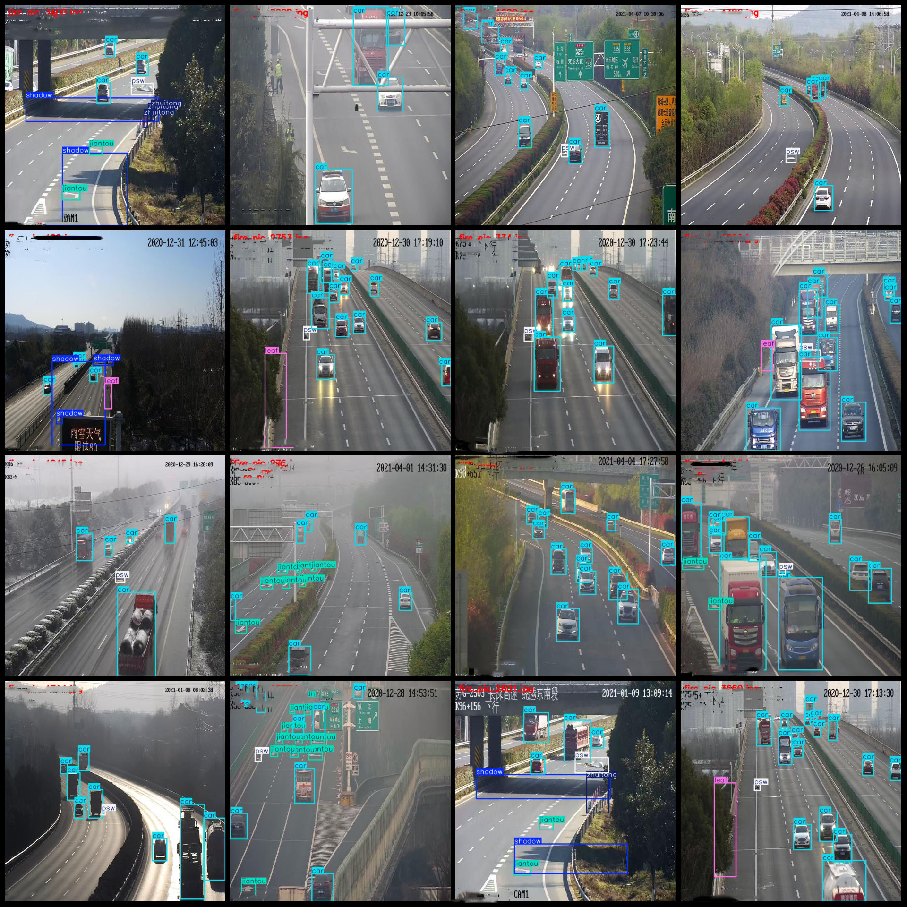
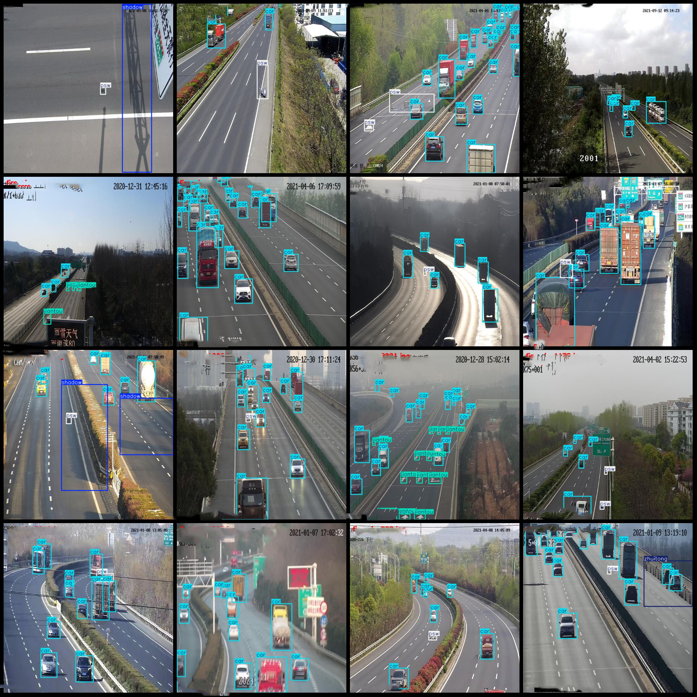

# High-Speed Road Traffic Signs, Particles, and Vehicle Water Bottles with Arrows Dataset in VOC+YOLO Format, 4846 Images, 9 Categories

Dataset format: Pascal VOC format+YOLO format(without split path's txtfile, only contain jpgimage and corresponding VOC format xmlfile and yolo format txtfile)
number of images: 4846  
4846
annotation count: 4846  
annotationnumber of classes: 9  
['Bird', 'Car', 'Jiantou', 'Leaf', 'Psw', 'Shadow', 'Shuima', 'Sjiaojia', 'Zhutong']
Number of boxes labeled in each category:
Bird has 8 frames.
The number of car boxes in the warehouse is 40634.
"jiantou" is a Chinese character. The English translation of "jiantou" is "jiantou".
Leaf (473)
PSW (particle size) Box count = 4302
"shadow" is translated to "shadow".

The number of "shadows" is given as 436, which is simply 436 in English.
Shuima (water squirt) box count = 298
Sjiaojia (tripod/warning sign) box count = 18
Zhuitong (cone barrel) box count = 1854
Total frames: 53810
images per class:   
Bird (bird) occupies a picture count = 8
Car images: 4560
Arrow images: 1201
Leaf (leaves) has 455 pictures.
psw(Puddle Sprayer) images = 3650
Shadow (shadow) occupies a number of images = 268
shuima(Water Bottle/Anti-collision Barrier) images = 181
"sjiaojia" is a Chinese character that translates to "tripod/warning sign". The number 18 is not part of the character, so it cannot be translated into English.
"ZhuTong" is a type of cone-shaped traffic barrier, also known as "Cone Barrier" or "Cone Traffic Barrier". It is mainly used to prevent vehicles from entering or exiting the construction area, and protect workers and pedestrians from potential dangers. The number of ZhuTongs in an image refers to the total count of ZhuTongs within that image.
Image resolution: 640x640
Use the labeling tool: labelImg
Annotation Rule: Draw a rectangle around the class.
Important Notes: The dataset does not have separate training, validation, and test sets; you need to partition them yourself.
Special Notice: This dataset does not guarantee the accuracy of the trained model or weight files.
Preview of the image:
## Image

Here is a pay link on Stripe ( https://buy.stripe.com/3cs8yP7sY87d0vu9AB ). Please contact me lonlonago@foxmail.com after funding $89, and I will send you a complete data files , thank you!

